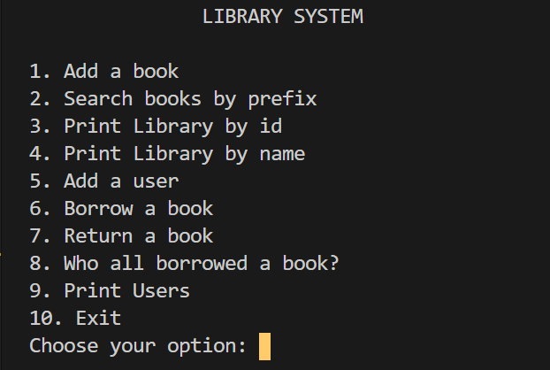

# Library-System
Simple Library System made using structures in C++

## About
This is a simple version of the classical library systems found in many libraries.

Currently there are no login/logout functionalities in this system. However, it will surely be added in the future versions.

The main user for this system is an admin who can:
* Add a book, user
* Perform relevant operations(Shown in the menu below)

_Here library is managed with a struct in the whole, hence making it more flexible and efficient. So,_ 
> library_systemV2.cpp is more efficient than library_system.cpp

I just included the latter because its a legit way to code the system

---
## Features

The features are shown in the snap above:
1. **Add a book**\
Admin can add books to the system. Each book has the following information:
	* id (integer)
	* name (string) -- no spaces for now
	* quantity (integer)

2. **Search books by prefix**\
Admin can search books in the database by prefixes.

3. **Print Library by id**\
Here the library is sorted by id of the books and printed.

4. **Print Library by name**\
Here the library is sorted by name of the books and printed.

5. **Add a user**\
Admin can add usersto the system who can inturn borrow/return books. Each user has the following information:
	* id (integer)
	* name (string) -- no spaces for now

6. **Borrow a book**\
Users can borrow books from the library. The admin has to enter the username and the bookname and the book will be successfully borrowed if it's available.

7. **Return a book**\
Same logic.

